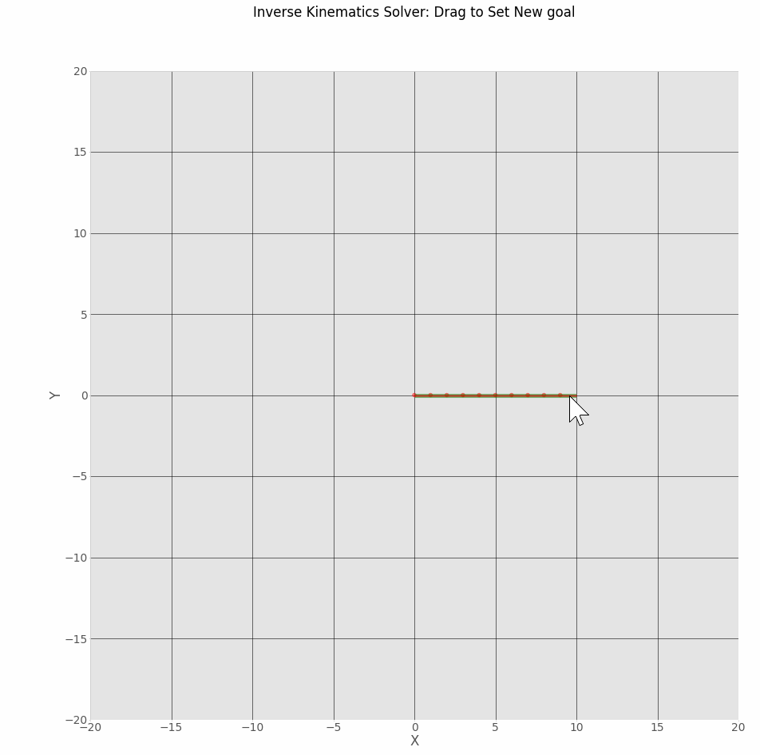
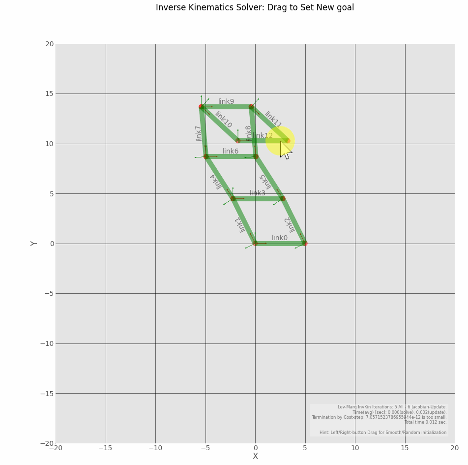
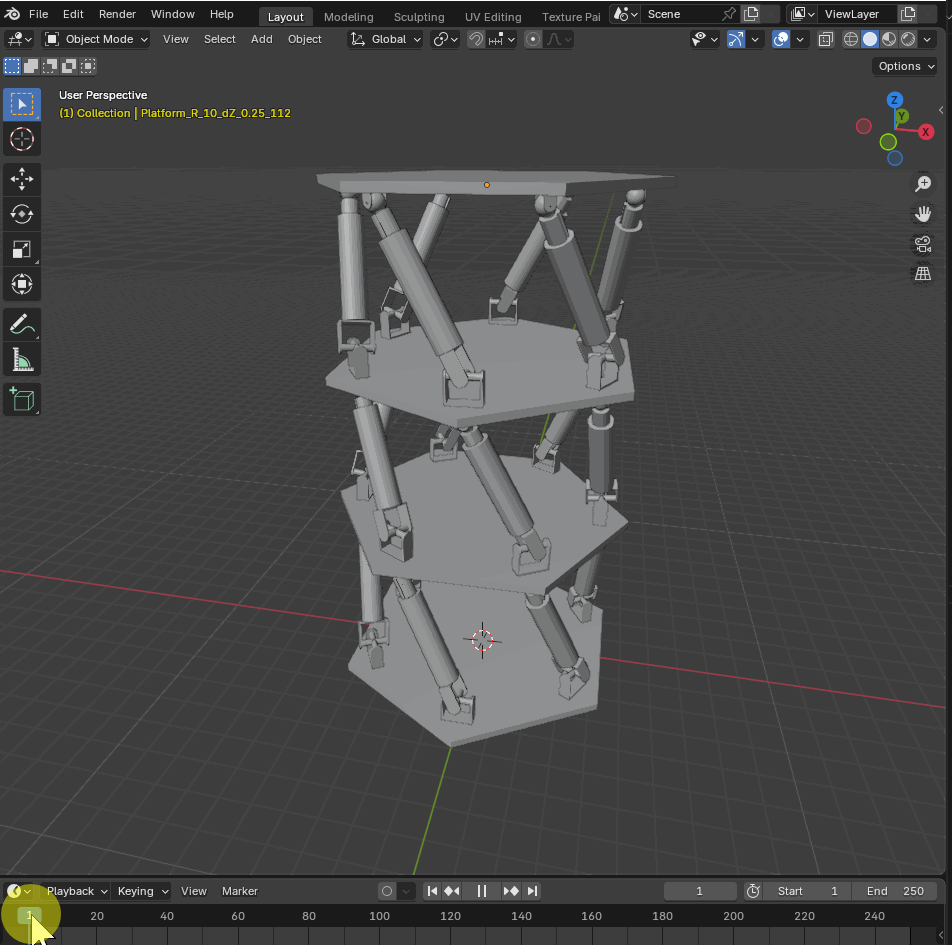
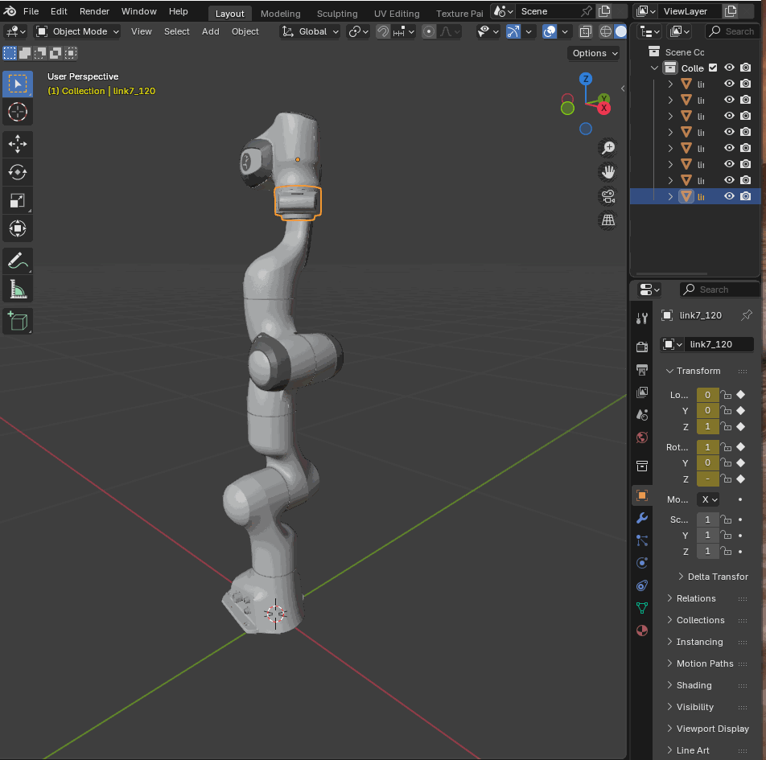

# Kinema - simple playground for complex kinematics

<p align="center">
  
  
  
  
</p>

## Intro

1. **Pythonic way of robot modelling** to define complex open and closed kinematic chains with a few lines of code
2. **Powered by JAX auto-differentiation** to compute Kinematics Jacobian with GPU and apply JIT-compilation to reach realtime speed!
3. **Automated closed kinematics-constraining** with `networkx` graph tracing
4. **Visualize the mechanisms** build in 2D (matplotlib) or 3D ([Blender3D](https://www.blender.org/))

## Examples

### Snake Robot (Sequential chain)
Declaring a 2D snake robot with rotational `Rz()` and prismatic `tx()` joints with 3 lines of code:
```python
from kinema.elementary_transforms import ET, ETS, SE3
from kinema import LinkDrawing2D
# Creates a 10-link snake mechanism (~3 lines)
tx = 1
links = LinkDrawing2D.generate_sequential_robot(
    num_links=10, link_length=tx, ets=ETS(ET.Rz() * ET.tx() * ET.tx(tx)), link_width=0.25)
```

### Closed kinematics in 2D
Creating interconnected mechanism with closed kinematics :
```python
import numpy as np
from kinema.link_kinematic import generate_multicycles_robot
from kinema import LinkDrawing2D

# Assemble complex multicycle structures
link_length, link_width = 5.0, 0.5
pt_start, pt_end = np.array((0, 0)), np.array((link_length, 0))
links = generate_multicycles_robot(
    LinkDrawing2D, (pt_start, pt_end, link_width), 
    link_length=link_length, 
    num_cycles=4
)
```

### Closed kinematics in 3D - Stacking Hexapods or Stewart Platforms
Creating full 3D linkages like a Hexapod (combining 6 prismatic leg chains to a dual platform) in less then 100 lines of code (meshes are required for visualization in [Blender3D](https://www.blender.org/)):
```python
def create_hexapod(mesh_root: str) :
    # Main dimensions of the main parts - platform, hinges, pistons, etc.
    base_height = 0.25
    hinge_height = 0.75
    piston_height = 3
    hinge_ball_height = 0.5

    # Polygon meshes of the corresponding parts
    platform_path = os.path.join(mesh_root, "Platform_R_10_dZ_0.25.dae")
    hinge_path = os.path.join(mesh_root, "Hinge_OX_dZ_0.75.dae")
    sleeve_path = os.path.join(mesh_root, "Sleeve_OZ_3.dae")
    piston_path = os.path.join(mesh_root, "Piston_OZ_3.dae")
    ball_path = os.path.join(mesh_root, "Ball_dZ_0.5.dae")
    hinge_ball_path = os.path.join(mesh_root, "HingeBall_OX_dZ_0.5.dae")

    # Function to create a prismatic joint
    def create_piston_chain(link_parents, ets_parents):
        l = LinkBlenderDrawing3D(hinge_path, link_parents=link_parents,
                                ets_l2ps=ets_parents )
        l = LinkBlenderDrawing3D(None, link_parents=l,
                                ets_l2ps=ET.tz(hinge_height) * ET.Rx())
        l = LinkBlenderDrawing3D(None, link_parents=l,
                                ets_l2ps=ET.Rz(np.pi/2) * ET.Rx())
        l = LinkBlenderDrawing3D(hinge_path, link_parents=l,
                                ets_l2ps=ET.tz(hinge_height) * ET.Rx(np.pi))
        l = LinkBlenderDrawing3D(sleeve_path, link_parents=l,
                                ets_l2ps=ET.Rx(np.pi))
        l = LinkBlenderDrawing3D(piston_path, link_parents=l,
                                ets_l2ps=ET.tz())#
        l = LinkBlenderDrawing3D(ball_path, link_parents=l,
                                ets_l2ps=ET.tz(piston_height + hinge_ball_height) * ET.Rx(np.pi) )
        l = LinkBlenderDrawing3D(hinge_ball_path, link_parents=l,
                                ets_l2ps=ET.tz(hinge_ball_height/2) * ET.Rx() * ET.Ry() * ET.Rz() * ET.tz(-hinge_ball_height/2) )
        return l

    # Function to define one platform and attached hinges (section)
    def create_hex_section(link_platform: LinkBlenderDrawing3D, num_piston_chains: int):
        pistons_placement_radius = 4
        angular_step = 2 * np.pi / num_piston_chains

        links_out = []
        for i in range(num_piston_chains):
            ets = ET.tz(base_height) * ET.Rz(angular_step * i) * ET.ty(pistons_placement_radius)
            links_out.append(create_piston_chain(link_platform, ets))
        return links_out

    # Creation of the complete mechanism - connection of several sections
    num_sections = 3
    # Number of prismatic joints in a section
    num_piston_chains = 6
    link_platform = LinkBlenderDrawing3D(platform_path)
    for section_id in range(num_sections):
        links_out = create_hex_section(link_platform, num_piston_chains)

        ets_platform_to_chains = []
        for i in range(num_piston_chains):
            ets_parent_to_world = links_out[i].get_orientation()
            if i == 0:
                # Use first chain for reference orientation(Z-height)
                ets_platform_to_world = ET.tz(ets_parent_to_world[2,3])
            
            ets_platform_to_chains.append(
                ets_parent_to_world.inv() * ets_platform_to_world)

        link_platform = LinkBlenderDrawing3D(platform_path, link_parents=links_out,
                                            ets_l2ps=ets_platform_to_chains)

    link_platform.init_transform()

    return link_platform
```

## Install

Python 3.11 is required (due to the [Blender3D](https://www.blender.org/) `bpy` package dependency).

To install the project in an editable mode using pip, run the following commands in your terminal:

```bash
# Create and activate a virtual environment
python -m venv .venv
# On Windows:
.venv\Scripts\activate
# On Linux/macOS:
# source .venv/bin/activate

# Install the package in editable mode
pip install -e .

# [OPTIONAL] IF you wish to try GPU-based computing (Windows is not supported yet), update JAX accordingly, e.g.
pip install -U "jax[cuda13]"
```

## Future Plans

1. Add parameter limits to the Lev-Marq optimization constraints

## License

The library and it's sources are released under the MIT License.

